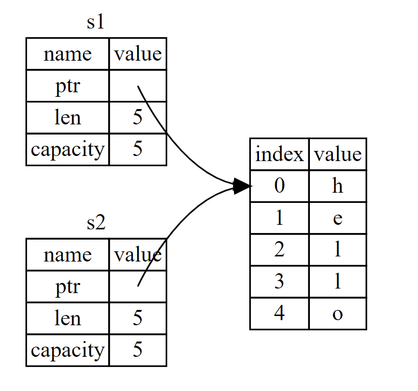
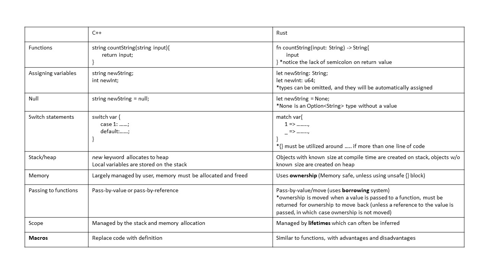

## Rust Basics

Cheat sheets are at the bottom of this section.

### Cargo (Rust's Package Manager)
Here is a list of handy Cargo commands with a description under each command. All commands need to be run in the base ```interceptor``` folder.

```cargo run```

Builds and runs the project.

```cargo run --bin FILE```

Builds and runs a specific binary within the project. This is needed when there are multiple files in the ```src/bin/``` directory.
 
```cargo build```  

Compiles the project into an executable.

```cargo check```  

Checks if the project can compile without actually compiling the project.

```cargo clippy```

Runs [Clippy](https://github.com/rust-lang/rust-clippy). This runs a collection of lints to catch common mistakes and improve code. Clippy must be added to the project in order to run it with Cargo.

```cargo test```

Runs all unit and integration tests built into the project.

**Note:** for the interceptor, since we are testing with global variables, tests need to be run with the following command: ```cargo test -- --test-threads=1```. This is because ```cargo test``` defaults to running tests in parallel, but with global variables being used tests need to be run on a single thread, one after another.

```cargo new NAME```  

Creates a new binary project with the name NAME.

```cargo new NAME --lib``` 

Creates a new library project with the name NAME.

```cargo doc --open```  

Generally only works for library projects. Generates documentation for the library and opens it in a new window. There might be a little bit of markdown that needs to be added to the library files in order for the documentation to be generated.  

The ```Cargo.toml```  contains dependencies for the project. Includes all the external crates that compile with the project.

### Differences From C Languages

By default, variables in Rust are immutable. The programmer has to specifically designate them as mutable (i.e. ```let mut var =...```). Rust also manages the heap and the stack differently. Any variable with a known size goes on the stack and any variable with an expandable memory footprint goes on the heap.  

The programmer does not explicitly use 'malloc' and 'free'. Although memory is being allocated and freed, Rust takes care of this in the background. Rust also does not have a garbage collector. Instead, the memory safety of the program is checked at compile time. This causes longer than usual compile-times, but the lack of garbage collector allows for faster run-times.  

Data types in Rust: integers (i64....u8), floats, booleans, Tuples, characters, Strings, Arrays, etc. Pretty much the same as C, only the number of bits for integers are stated. There are no classes in Rust. Instead, memory in managed through structs, traits, enums, etc. There are also no ```null``` values. This contributes to memory safety. Instead, Rust has an ```Option``` enum that can be seen below.

```
enum Option<T> { 
         Some(T), 
         None, 
}
```

This is a wrapper class that either has ```Some``` value of Type ```T``` or a ```None``` value. Rust programmers access this code by either using a ```match``` statement or ```.unwrap()```; however, ```.unwrap()``` causes a panic if the data that is being accessed in improperly used at runtime. Code should not be unwrapped in production. Instead, a match statement should be used for error checking.

### Object-Oriented Programming

Rust is technically not object-oriented because of the definition of objects, but this distinction really depends on the user's definition of object-oriented. Although Rust doesn't have classes, it does have other ways of managing data that parallels classes in other languages. For instance, here's a comparison of attributes of object-oriented C++ and their Rust counterparts.  

|C++	                  |Rust  	
|---	                  |---	
|Encapsulation             |Pub/private functions	
|Inheritance               |Traits
|Polymorphism              |Generics/Types 

Here is an example of traits and how they work inheritance in Rust:

```
pub trait Summary { 
         fn summarize_author(&self) -> String; 

         fn summarize(&self) -> String { 
                  format!("(Read more from {}...)", self.summarize_author())
         } 
}
```

This creates the ```Summary``` trait that implements the ```summarize_author``` and ```summarize``` functions. Anything that implements this trait will also implement these functions. Since ```summarize_author``` doesn't have an implementation within the trait, it needs to be defined by whatever type implements the trait. Take the ```Tweet``` type as an example:

```
impl Summary for Tweet { 
         fn summarize_author(&self) -> String { 
                  format!("@{}", self.username) 
         } 
}
```

The ```Tweet``` type implements the ```Summary``` trait and defines the ```summarize_author``` function. In this case, ```Tweet``` can also utilize the ```summarize``` function since it is defined in the ```Summary``` trait that ```Tweet``` implements. ```Tweet``` also has the ability to override the definition of ```summarize``` in the ```Summary``` trait by creating its own definition in the implementation block.

### Macros

Macros in Rust are more similar to functions than they are similar to macros in C languages. There are both advantages and disadvantages when it comes to using macros.  

Advantages:  
* Macros can take variables parameters in Rust while functions cannot.  
* Functions cannot process input parameters such as token trees, while macros are able to.  
* Macros are expanded before the compiler interprets code. 
  
Disadvantages:  
* Macros are very difficulty to understand when just reading over code.  
* Compiler errors for macros are not as discriptive in Rust.  
* Macros from external libraries are not automatically included in a Rust project when an external library is included. This is to avoid having multiple external libraries with the same macro definition causing issues. The user must manually include the macro from the external library in order to use it in their project as shown below:

```
#[macro_use] 
extern crate external_crate;
```

This includes the macros from the external crate ```external_crate``` (this is just an example crate). Macros must be defined in a file before they can be used. Functions can be defined anywhere in the file and used anywhere as long as the compiler/linker knows where to find them. There are more advantages and disadvantages to macros that I am not familiar with. 

### Enums

Enums are also a bit different in Rust than they are in C languages. Rust enums are very powerful and are incredibly helpful when it comes to data management. There were two main situations in which I found enums to helpful. The first was the ability to declare multiple structs all under one type.

```
enum Message { 
         Quit, 
         Move { x: i32, y: i32 }, 
         Write(String), 
         ChangeColor(i32, i32, i32), 
}
```

This creates four different structs, each with different parameters, each of type ```Message```. Another use for enums is using them in a sort of subclass-superclass model. For example:

```
enum Connection {
         Kafka(KafkaEntry),
         Kusto(KustoEntry),
         Sentinel(SentinelEntry),
}
```

In this case, ```Kafka```, ```Kusto```, and ```Sentinel``` are all of type ```Connection```. This means that any of these three enumerated types (the subclasses) can be utilized wherever a program requires anything of the ```Connection``` type (the superclass). Also, each of these "subclasses" store different types of data. This allows the programmer to have some fun with how data is managed.

### Lifetimes

Lifetimes are very complicated and I'm going to preface this section by letting you know there is a lot about them I do not know but this is a basic overview.  
  
Lifetimes allow the user to explicity declare the scope of a variable they are using. When a lifetime isn't explicitly stated, the compiler can imply the scope of the variable and use that as the lifetime. Declaring a lifetime allows the user to go against what the compiler would implicitly decide when it comes to the scope of a variable. Here's an example below:

```
struct Foo<'a> {
    x: &'a i32,
}

fn main() {
    let y = &5;                     // -+ y goes into scope
    let f = Foo { x: y };           // -+ f goes into scope
}                                   // -+ f and y go out of scope
```

The lifetime declared here is ```'a``` on ```Foo```. Here, the programmer is stating that ```Foo``` needs to have the same lifetime as ```x```, or the ```i32``` variable contained within ```Foo```. In this case, the lifetime parameter can be omitted from the struct declaration and the compiler would automatically determine the lifetime of a ```Foo``` instance; however, in other examples explicitly stating a lifetime can be very valuable.

### Ownership

Ownership is the most vital topic to understand in order to know why Rust is memory safe. Rust manages memory differently from C-based languages, by utilizing ownership to ensure there are no memory exploits. Basically, the Rust compiler checks code at compile time for the possibility of memory issues. If there is a possibility of issues, the code will not compile. In order to ensure code will compile, a programmer must follow three rules of Ownership listed below:  
  
* Every value has a variable that is its owner
* Each value can only have one owner
* When the owner goes out of scope, so do its values
  
Let's say I declare these variables:

```
let s1 = String::from("hello");
let s2 = s1;
```

This situation can be visualized through the following diagram:   


Here we can see that ```s1``` and ```s2``` are variables with a finite size created on the stack, while the String ```hello!``` has an expandable memory footprint and was created on the heap. Similar to many other languages, Rust defaults to "shallow" copies as seen in this example. **Note:** Deep copies are set by default if the variable implements the ```copy``` trait and deep copies can be forced by using ```.clone()``` if the variable implements the ```clone``` trait.

In this example, the first owner of the string value is ```s1```, because of the first rule of ownership. When the string is created on the heap, it must have a variable that owns it (in this case, ```s1```). When ```s2``` is set equal to ```s1```, the second rule of ownership kicks in. Since each value can only have one owner, either ```s1``` or ```s2``` must be that variable's owner. Thus, Rust defaults to the later variable (assuming this is the variable the programmer wants to use otherwise it would not have been created) being the new owner of the value. Because of this, ```s1``` can no longer be used to access the string I created.  

To display the last rule of ownership, let's say I pass ```s2``` into a function:  

```
some_function(s2);
```

In Rust, when a variable is passed into a function, the ownership of the values that variables owns is also passed into that function so the called function can access those values. This is the case with ```s2```, the ownership of its owned values is passed into the scope of ```some_function``` with the variable. When the program returns to the calling function and ```some_function``` is popped off the stack, so is the variable we passed in. Displaying the third rule of ownership, the value ```s2``` owned is no longer available in the calling function since ```s2``` is now out of scope.  

This isn't the case if the value is returned from the called function. When a value is returned in Rust, so is ownership of that value. Also, if a value is passed by reference to a function (using ```&```), ownership of that value is not passed to the called function and remains in the calling function. However, ownership of the reference is passed into the function which allows the function to still be able to access values the variable references. This is a bit confusing and can be better explained by some of the resources at the bottom of this document. Also, if a programmer wants to edit a value in a function, they must remember to pass it as a mutable variable (and return it as a mutable variable if appropriate), like so:

```
fn main() {
         let mut x: i32 = 16;
         foo(&mut x); //calling the function
}

//declaration of function
fn foo(x: &mut i32) -> &mut i32 {
         *x = 5;
         x
}
```  

Ownership and borrowing (the concept of passing to a function by reference) are very complex and can be hard to comprehend. My knowledge of the concepts is limited, so if you would like to learn more I suggest perusing the links at the bottom of this document.

### Unsafe Rust

You can go outside of Rust's memory checker by using an ```unsafe``` block as seen below.

```
unsafe {
         //code here
}
```

This allows you to do anything you want with regard to memory, but know that you are responsible for checking your memory and Rust is no longer guaranteed to be safe! Basically, don't do this if you don't have to and only do it if you really know what you're doing when it comes to memory management.

## If you ain't cheatin' you ain't tryin'

Rust [cheat sheet](https://cheats.rs/).  

Below is a table with simple Rust info and differences between Rust and C++. If you find anything in it to be inaccurate, please fix it. More detailed information about Rust can be found at the links below the image.
  

More information on:  
  
* [ownership](https://doc.rust-lang.org/book/ch04-00-understanding-ownership.html).   
* [lifetimes](https://doc.rust-lang.org/1.9.0/book/lifetimes.html).   
* [macros](https://doc.rust-lang.org/1.9.0/book/macros.html).   
* [borrowing](https://doc.rust-lang.org/1.9.0/book/references-and-borrowing.html).   
  
More information on other topics can be found by perusing [this link](https://doc.rust-lang.org/stable/book/).
